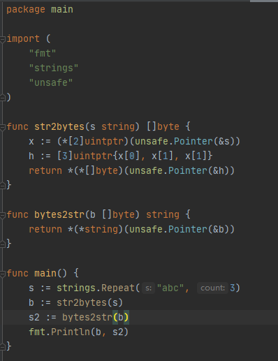

# string 从 "abc" 到 "abcd"，如何分配内存的(不太清楚意图，凭感觉答)
在golang中，string的底层实际上是一个结构体，结构体有两个字段，一个str是一个指针，指向数组的首地址，一个是len代表数组的长度。***str指向的是一个字符常量的地址，这个地址里面的内容是不可以被改变的，因为他是只读的，但是可以指向不同的地址***。所以从"abc"到"abcd"需要先分配存储"abcd"的内存空间，然后结构体的str指针指向这块内存，之前分配的空间还需要gc回收。

#  unsafe 包 简介
golang弱化了指针的操作，不能进行指针运算，指针的类型也不能进行转换。
## unsafe.Pointer
Pointer本质上值一个int指针。***uintptr本质上是一个用于表示地址的无符号整数，而不是一个引用，它表示程序中使用的某个对象的地址值。***
他有如下的特性:
1. 任意类型的指针值都可以转化为unsafe.Pointer
2. unsafe.Pointer可以转换为任意类型的指针值
3. uintptr可以转换为unsafe.Pointer
4. unsafe.Pointer可以转换为uintptr
要注意以下几点：
1. 指针类型转换的时候，要保证转换后的类型大小不大于转换钱的类型大小，且具有相同的内存布局。否则在后续的读写过程中，可能会发生错误。
## unsafe.Pointer和uintptr的区别
1. unsafe.Pointer只是单纯的通用指针类型，用于转换不同类型指针，它不可以参与指针运算；
2. 而uintptr是用于指针运算的，GC 不把 uintptr 当指针，也就是说 uintptr 无法持有对象， uintptr 类型的目标会被回收；
3. unsafe.Pointer 可以和 普通指针 进行相互转换；
4. unsafe.Pointer 可以和 uintptr 进行相互转换。

# string 和 []byte 的高效转换
通过unsafe.pointer和uintptr进行高效转换。正常的转换都会涉及底层数据的拷贝，而使用强转换的话直接替换指针的指向，从而使得string和[]byte指向同一个底层数组。

# goroutine 内存泄露
1. goroutine在channel读写的过程中阻塞
2. goroutine死锁。
## 例子
常见的生产者消费者模型，有100个请求，有1个生产者在生产，由10个消费者来消费，通过channel进行通信(for-range循环)，请求处理完成以后，生产者（主任务）结束了，而10个消费者由于channel没有退出，而阻塞。导致内存泄露。

# goroutine没有id
每个线程都有一个id，这个在线程创建时就会返回，所以可以很方便的通过id操作某个线程。但是在goroutine内没有这个概念，所以不能在一个协程中杀死另一个协程，编码时需要考虑到协程什么时候创建，什么时候释放。

# 接口(interface)
值接收者实现的接口可以接收值类型和指针类型，Go语言有对指针类型变量求值的语法糖。