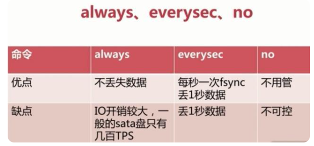

# redis的数据类型(5种)
1. String(字符串):一个key对应一个value，是二进制安全的
2. Hash(哈希):是一个键值对的集合，是一个string类型的field和value的映射表，hash特别适合用户存储对象。
3. List(列表):一个字符串列表，可以按照插入顺序排序，可以添加一个元素到列表的头部(左边)或者尾部(右边)。
4. Set(集合):string类型的无序集合，集合是通过hash表实现的，所以添加、删除、查找的复杂度都是O(1)
5. ZSet(有序集合):string类型元素的集合，ZSet每个元素都会关联一个double类型的分数，redis通过分数来为集合中的成员进行从大到小的排序。

# redis的持久化
## redis简介
redis是一个内存数据库，数据保存在内存中，但是内存的数据变化快，容易发生丢失。
## 持久化机制
1. ### RDB(Redis DataBase)
   * RDB就是把数据以快照的方式保存在磁盘上。
   * RDB持久化就是在指定的时间间隔内把内存中的数据集快照写入磁盘。也是默认的持久化方式。
   * 这种方式就是讲内存中数据以快照的方式写入二进制文件中，默认的文件名为dump.rdb。
   * RDB的三种触发机制：save、bgsave、自动化。
      + save：该命令会阻塞当前的redis服务器，执行save命令期间，redis不能处理其他命令，直到RDB过程完成为止。执行完以后如果存在旧的rdb文件，就进行替代。如果存在多客户端，该方式不可取。
      + bgsave：执行该命令时，Redis会在后台异步进行快照操作，快照同时还可以响应客户端请求。具体操作是：Redis进程执行fork操作创建子进程，RDB持久化过程由子进程负责，完成后自动结束。阻塞只发生在fork阶段。Redis内部的RDB都是采用bgsave命令。
      + 自动触发：由我们的配置文件来实现。配置项如下
         * save:用来配置触发的条件，eg："save m n"。表示m秒内数据集存在n次修改时，自动触发bgsave
         * stop-write-on-bgsave-error:默认yes。当启动RDB且最后一次后台保存数据失败，Redis是否停止接收数据。 
         * rdbcompression：对于存储到磁盘中的快照，是否进行压缩存储。
        * rdbchecksum：默认值是yes。在存储快照后，我们还可以让redis使用CRC64算法来进行数据校验
        * dbfilename：设置快照的文件名，默认是 dump.rdb
        * dir：设置快照文件的存放路径，这个配置项一定是个目录，而不能是文件名。
   * RDB的优劣势
      1. 优势
         * RDB文件紧凑，全量备份，非常适合用于进行备份和灾难恢复。
         * 生成RDB文件的时候，redis主进程会fork一个子进程来处理所有保存工作，主进程不需要进行任何磁盘IO操作
         * RDB在恢复大量数据集时的速度比AOF的恢复速度快。
      2. 劣势
         * 持久化时，子进程会拥有父进程的内存数据，但是父进程修改内存子进程不会反映出来，在快照持久化期间修改的数据不会被保存，可能丢失数据
   * save和bgsave的区别
      1. save是同步的，bgsave是异步的。
      2. save是全程阻塞的，bgsave的阻塞只发生在fork
      3. save不消耗内存，但是阻塞客户端命令。bgsave刚好相反。
2. ### AOF(Append Only File)
   * redis会将每一个收到的写命令都通过write函数追加到文件中。类似于日志记录。每当有一个写命令过来时，就直接保存在我们的AOF文件中
   * 文件重写：AOF会导致持久化文件越来越大。为了压缩AOF持久化文件。Redis提供了bgrewriteaof命令。将内存中的数据以命令的方式保存到临时文件中，同时会fork出一条进程来讲文件重写。***重写aof文件的操作，并没有读取旧的aof文件，而是将整个内存中的数据库内容用命令的方式重写了一个新的aof文件，这点和快照有点类似。***
   * AOF的三种触发机制：always、everysec、no
      1. always(每修改同步)：同步持久化。每次发生数据变更会被立即记录到磁盘。性能较差但是数据完整性比较好。
      2. everysec(每秒同步)：一步操作，每秒记录。如果一秒内宕机，有数据丢失
      3. no(不同步)：从不同步。

      
   * AOF优缺点
      1. 优点
         * AOF可以更好的保护数据不丢失。一般AOF会每隔一秒，通过一个后台线程执行一次fsync操作，最多丢失一秒钟的数据
         * AOF日志文件没有任何磁盘寻址的开销，写入性能非常高，文件不容易破损。
         * AOF日志文件即使过大的时候，出现后台重写操作，也不会影响客户端的读写。
         * AOF日志文件的命令通过非常可读的方式进行记录，这个特性非常适合做灾难性的误删除的紧急恢复。比如某人不小心用flushall命令清空了所有数据，只要这个时候后台rewrite还没有发生，那么就可以立即拷贝AOF文件，将最后一条flushall命令给删了，然后再将该AOF文件放回去，就可以通过恢复机制，自动恢复所有数据
      2. 缺点
         * 对于相同数量的数据集而言，AOF文件通常要大于RDB文件。RDB 在恢复大数据集时的速度比 AOF 的恢复速度要快。
         * 根据同步策略的不同，AOF在运行效率上往往会慢于RDB。总之，每秒同步策略的效率是比较高的，同步禁用策略的效率和RDB一样高效。

# Redis 跳表数据结构
## 什么是跳跃表？
链表加多级索引的结构,***一般是在有序链表中使用***。eg：每两个结点提取一个结点到上一级。抽取出来的那一级叫做索引。当我们需要查找数据的时候，从最高级开始往下查找，降低时间复杂度。
## Redis跳跃表
Redis使用跳跃表作为有序集合键的底层实现之一。如果有序集合包含的元素数量比较多，或者有序集合中元素的成员是比较长的字符串时，Redis就会使用跳跃表来作为有序集合键的底层实现。
### 为什么元素数量比较多或者成员是比较长的字符串的时候使用跳跃表
跳跃表在链表的基础上增加了多级索引以提升查找的效率，但其是一个空间换时间的方案，必然会带来一个问题——索引是占内存的。原始链表中存储的有可能是很大的对象，而索引结点只需要存储关键值值和几个指针，并不需要存储对象，因此当节点本身比较大或者元素数量比较多的时候，其优势必然会被放大，而缺点则可以忽略。
## Redis跳跃表的实现
Redis的跳跃表是由zskiplistNode和zskiplist两个结构定义，zskiplistNode结构用于表示跳跃表节点,而 zskiplist结构则用于保存跳跃表节点的相关信息,比如节点的数量,以及指向表头节点和表尾节点的指针等等。