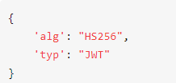
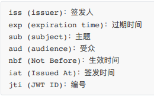
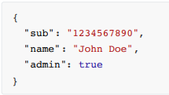

# 用户认证
## 简介
HTTP 是⼀个⽆状态的协议，⼀次请求结束后，下次在发送服务器就不知道这个请求是谁发来的了（同⼀个 IP 不代表同⼀个⽤户），在 Web 应⽤中，⽤户的认证和鉴权是⾮常重要的⼀环。
## 认证模式
1. ### Cookie-Session 认证模式
   - 客户端使用用户名、密码进行验证
   - 服务端验证用户名、密码正确后生成token，并将用户数据以key：value的形式存储在Session中。并将token通过Cookie返回给客户端
   - 客户端请求时都会带上Cookie。
   - 服务端通过SessionID进行认证，如果有登录就放行，返回客户端需要的数据。
   - 存在的问题
      * 服务端需要存储Session，并且由于Session需要快速查找，通常存储在内存或内存数据库中，会占用大量内存。
      * 在跨域场景下兼容性不好。
2. ### JWT（JSON-Web-Token） 认证模式
   - JWT的结构，由三部分构成，各部分用圆点(.)连接：
      * Header：由两部分组成，token的类型(JWT)和算法名称(比如SHA256)。然后用Base64对这个JSON编码得到JWT的第一部分。

        
      * Payload：它包含声明(要求)。也是一个JSON对象，JWT规定了7个官方字段供选择

        
        
        除了官方字段，开发者也可以自己制定字段和内容，例如

        

        JWT默认是不加密的，任何人都可以看到，所以不要把秘密信息放在这个部分，这个JSON对象也是使用Base64URL算法转成字符串的
      * Signature：对前面两个部分的签名，防止数据篡改，他需要指明一个秘钥。这个秘钥只有服务器才知道，不能泄露给用户。然后使用Hearer里面指定的签名算法，产生签名。
   - JWT的优缺点
      * 服务端不再需要存储Session，使得服务器认证鉴权业务可以方便扩展。
      * JWT Token一旦签发，就会在有效期内一直可用，无法在服务端废弃，如果要禁用用户，单纯使用JWT就无法做到。
